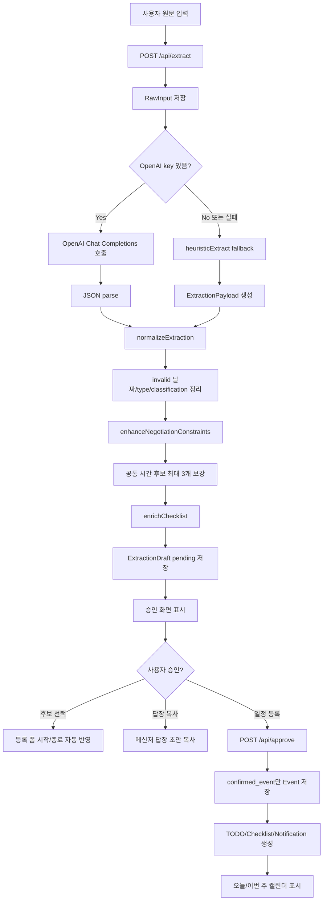

# Presentation Pipeline

이 문서는 금요일 시연에서 설명할 GPT 전송 구조와 전체 처리 파이프라인을 정리합니다.

## 시연 목표

정제되지 않은 카톡/이메일/STT/메모 원문을 붙여넣으면 앱이 일정을 바로 저장하지 않고, AI 추론 결과를 사용자에게 먼저 승인받습니다.

핵심 시연 흐름:

1. 원문 입력
2. GPT 또는 fallback 로직으로 일정 후보 추론
3. 시간 조율 일정이면 공통 가능 시간 후보 생성
4. 사용자가 후보 선택
5. 메신저 답장 초안 복사
6. 승인 후 가상 캘린더, TODO, 체크리스트, 알림 저장

## GPT API 요청 구조

구현 위치:

- `src/lib/ai.ts`
- 함수: `extractSchedule(rawText, inputType)`

요청 endpoint:

```text
POST https://api.openai.com/v1/chat/completions
```

요청 옵션:

```ts
{
  model: process.env.AI_MODEL || "gpt-4.1-mini",
  temperature: 0.1,
  response_format: { type: "json_object" },
  messages: [
    {
      role: "system",
      content: buildSystemPrompt()
    },
    {
      role: "user",
      content: `입력 타입: ${inputType}
기준 날짜: ${getBaseDateKst()} Asia/Seoul

원문:
${rawText}`
    }
  ]
}
```

## System Prompt 핵심 규칙

GPT에는 아래 규칙을 전달합니다.

- JSON 객체 하나만 반환
- 사용자 승인 전 확정 등록처럼 말하지 않기
- 확정 일정이면 `confirmed_event`
- 시간 조율 중이면 `negotiating_event`
- 정보가 부족하면 `needs_more_info`
- TODO만 있으면 `todo_only`
- 일정 관련이 아니면 `not_schedule_related`
- 상대 날짜 표현은 기준 날짜와 `Asia/Seoul` 기준으로 ISO 문자열화
- 참석자별 가능/불가능 시간은 `time_constraints`에 넣기
- 미확정 회의는 `events`에 확정 일정으로 만들지 말고 `suggestions`에 제안 또는 질문 넣기
- 공통 가능 시간이 여러 개면 `suggestions`에 2~3개 후보 넣기
- 체크리스트는 원문 준비물과 문맥 기반 추천 준비물을 함께 넣기

## GPT 응답 JSON Shape

```json
{
  "classification": "confirmed_event",
  "confidence": 0.86,
  "title": "팀 회의",
  "assistant_message": "내일 오후 3시 팀 회의로 등록할까요?",
  "raw_summary": "내일 오후 3시에 팀 회의를 하자는 내용",
  "events": [
    {
      "title": "팀 회의",
      "start_at": "2026-06-06T15:00:00+09:00",
      "end_at": null,
      "location": "강남역",
      "description": "원문에서 추론된 회의",
      "source_confidence": 0.84
    }
  ],
  "todos": [],
  "checklist": ["회의 안건 메모", "필기구", "자료 확인"],
  "participants": ["김시현", "조현준"],
  "time_constraints": [],
  "suggestions": [
    {
      "type": "register_event",
      "message": "팀 회의로 등록할까요?",
      "candidate_start_at": "2026-06-06T15:00:00+09:00",
      "candidate_end_at": null,
      "risk": null
    }
  ],
  "missing_fields": []
}
```

## 서버 처리 파이프라인



## 승인 전 저장 방지 로직

앱은 GPT가 잘못된 응답을 줘도 바로 확정 일정으로 저장하지 않습니다.

- `normalizeExtraction()`에서 invalid 날짜, 잘못된 classification, 잘못된 suggestion type 정리
- `confirmed_event`라도 유효한 `start_at`이 없으면 `needs_more_info`로 낮춤
- `negotiating_event`, `todo_only`, `not_schedule_related`는 `events`를 비움
- 저장 단계 `buildEvent()`에서도 `classification === "confirmed_event"`이고 `start_at`이 있을 때만 Event 생성

## 시간 조율 처리

시간 조율은 GPT 결과에만 의존하지 않고 deterministic 보강을 합니다.

지원 예시:

- `토 2-4, 6-`
- `토요일 7시 전까지 안됨`
- `일요일 하루종일 가능`
- `토요일 2시부터 6시까지 가능`

처리 방식:

1. 참석자별 available/unavailable window 수집
2. 가능 시간의 교집합 계산
3. 불가능 시간 차감
4. 긴 공통 구간은 1시간 단위 후보로 분할
5. 최대 3개 후보를 `suggestions`로 제공
6. 사용자가 후보를 선택하면 등록 폼에 자동 반영

## 시연 멘트 예시

짧은 설명:

> 이 앱은 카톡 원문을 바로 캘린더에 넣지 않고, AI가 먼저 일정 후보와 시간 조율 후보를 추론한 뒤 사용자에게 승인받는 구조입니다. GPT 응답은 JSON contract로 제한하고, 서버에서 다시 검증해서 확정되지 않은 일정은 Event로 저장하지 않습니다.

시간 조율 설명:

> 회의 시간이 정해지지 않은 카톡 대화에서는 참석자별 가능한 시간과 안 되는 시간을 나눠서 추출하고, 공통 가능 시간 후보를 최대 3개까지 제안합니다. 후보를 누르면 등록 폼에 시간이 자동으로 들어가고, 상대에게 보낼 답장 초안도 복사할 수 있습니다.

안전성 설명:

> GPT가 틀린 형식이나 애매한 시간을 반환해도 normalize 단계에서 날짜와 classification을 검증합니다. 사용자 승인 전에는 확정 Event가 만들어지지 않습니다.
